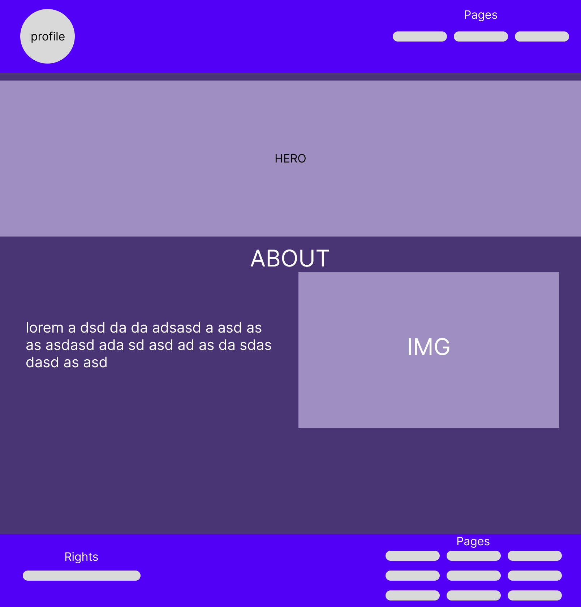
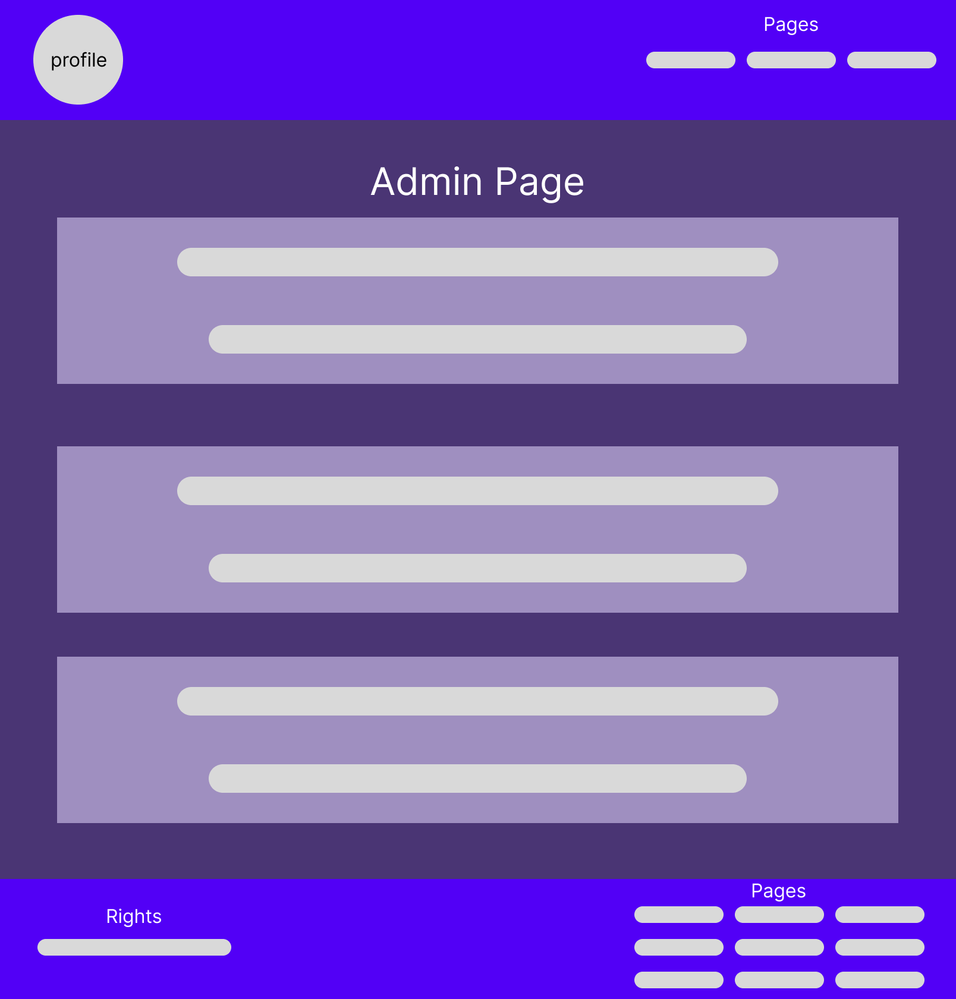
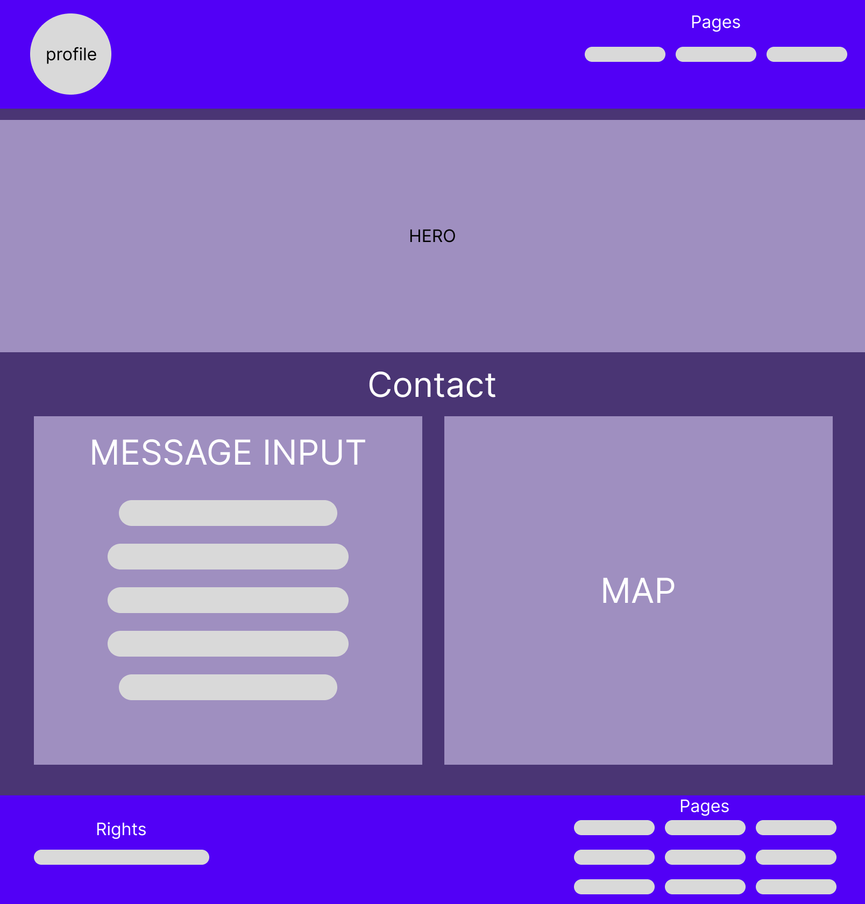
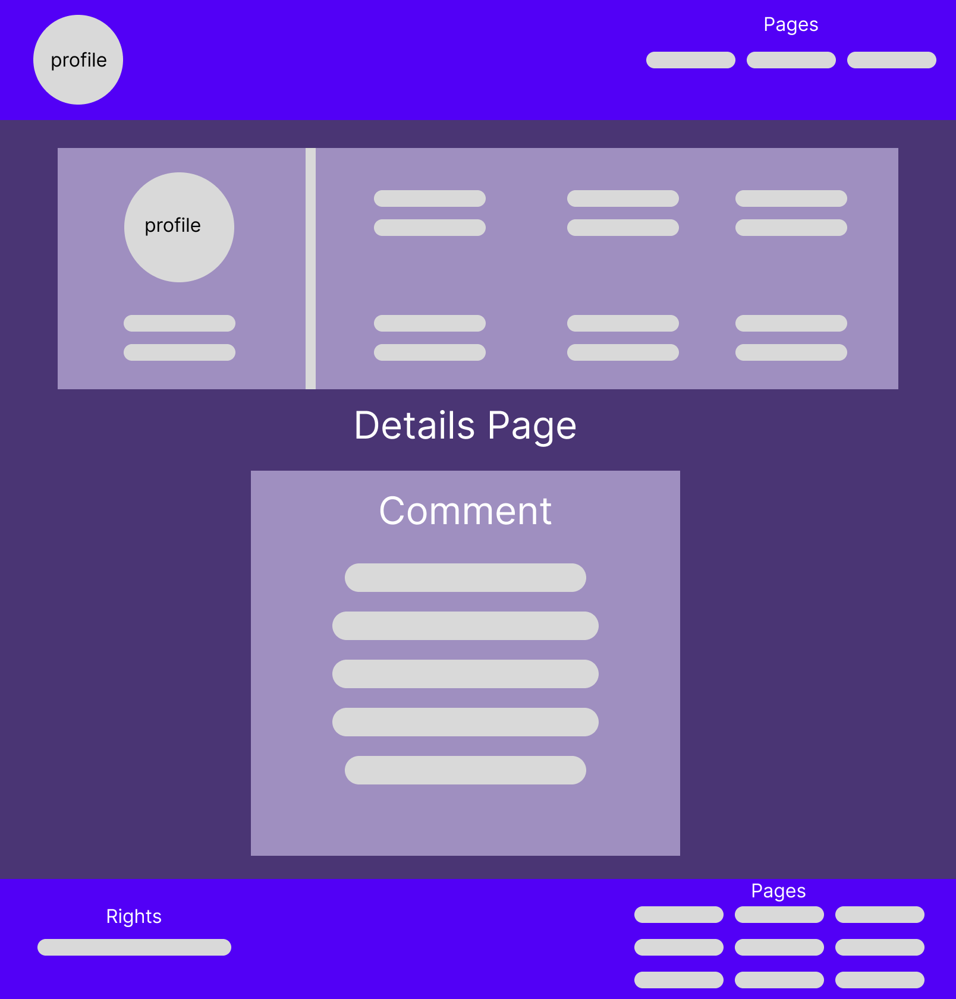
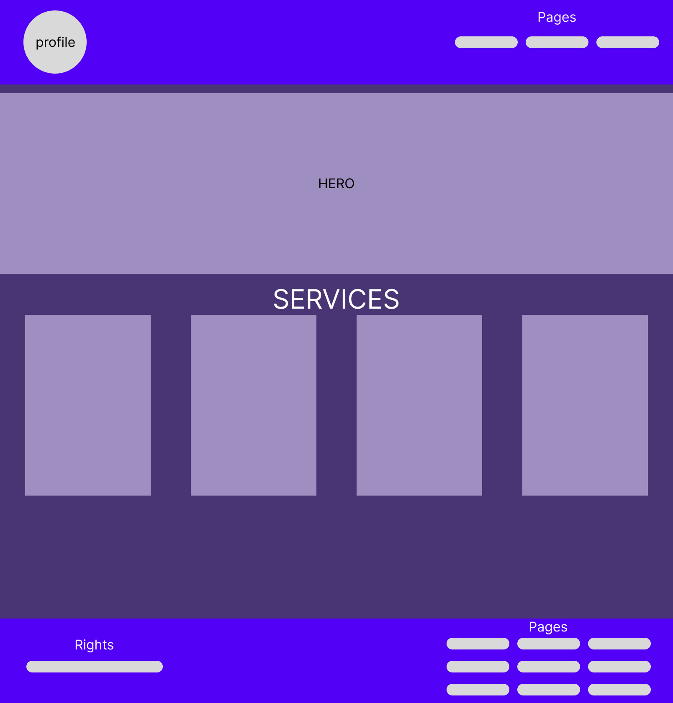
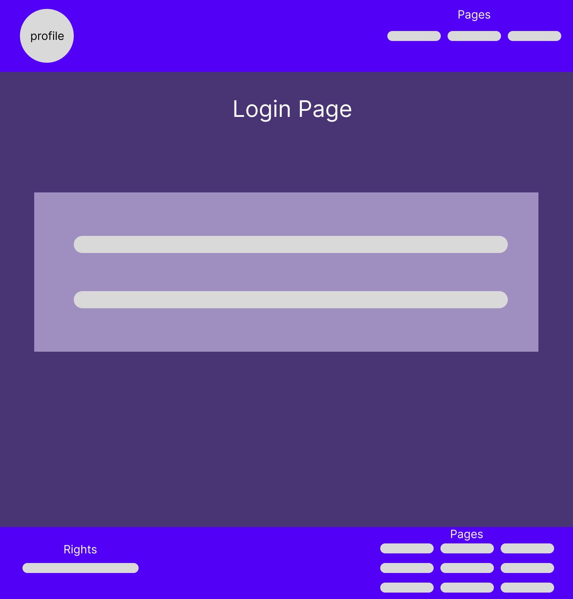
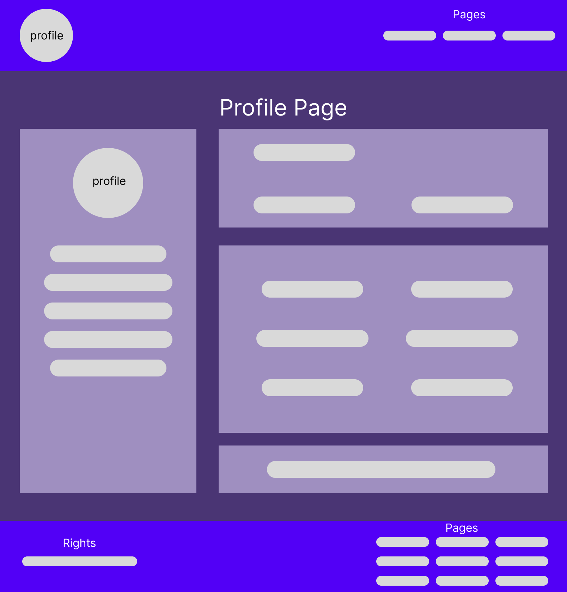
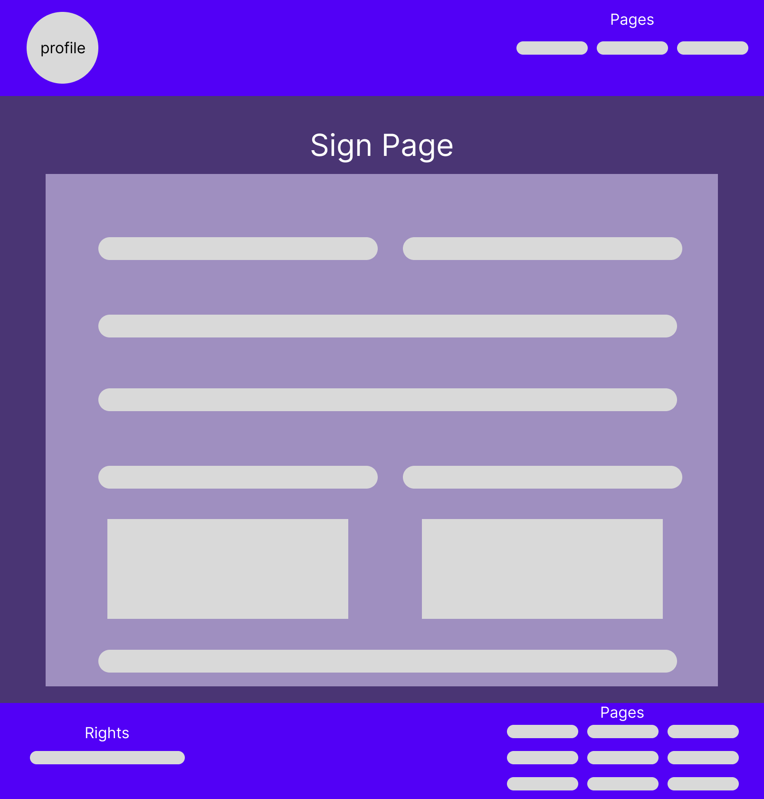
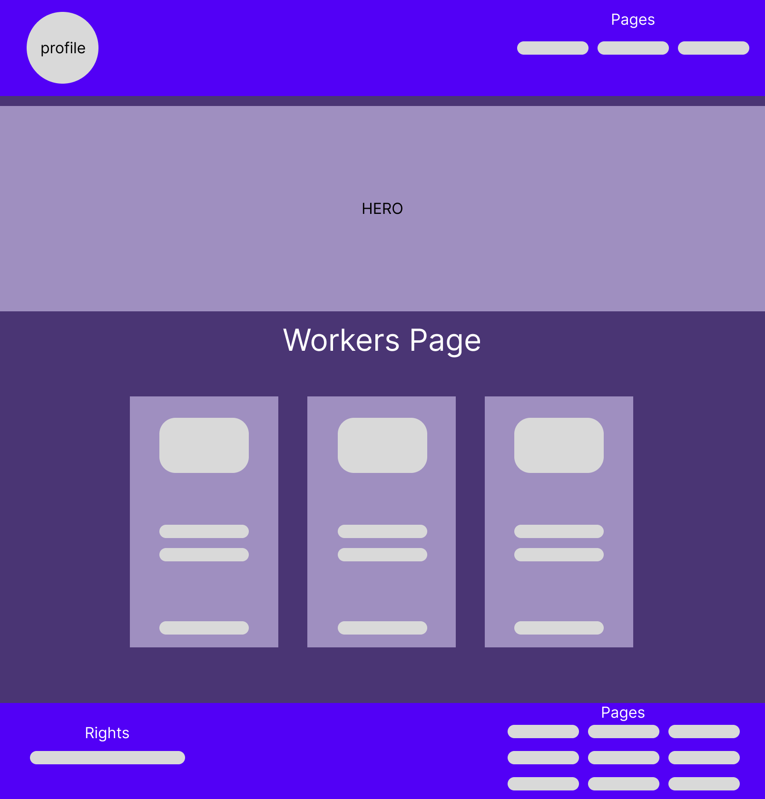

Project Name:
Munjez

[==================================================================]

[==================================================================]

Project Description:
Munjez is a web-based platform that offers home maintenance services in a simple and secure way. Users can request skilled technicians in various fields such as electricity, plumbing, air conditioning, and carpentry to arrive at their homes at the scheduled time. The platform primarily targets elderly individuals and those who prefer convenience without the hassle of supervising or frequently changing workers.

[==================================================================]

Features List:
Book a maintenance technician directly from the website

Choose the type of service (plumbing, electrical, AC, carpentry, etc.)

View technician profiles and qualifications before submitting a request

Track the status of the service request after submission

User dashboard to review previous service requests

Rate the technician after service completion

Option to easily repeat a previous service request

[==================================================================]

UML:

Home > Workers > Details > Booking
Sign > Corner avatar > Profile
Profile > Edit Update Cansel

[==================================================================]

Admin permissions:
    Delete User
    Activate User
    Deactivate User

Worker permissions:
    Cancel Appointment
    Accept Appointment

Customer permissions:
    Update Appointment
    Cancel Appointment

[==================================================================]

Users you can sign in with:
[======================]
    Username: customer1
    Password: customer1
[======================]
    Username: customer2
    Password: customer2
[======================]
    Username: worker1
    Password: worker1
[======================]
    Username: worker2
    Password: worker2
[======================]
    Username: worker3
    Password: worker3
[======================]
    Username: worker4
    Password: worker4
[======================]
    Username: admin
    Password: admin
[======================]

[==================================================================]

Wire Frame:

[==================================================================]
Best regards! NK :)
